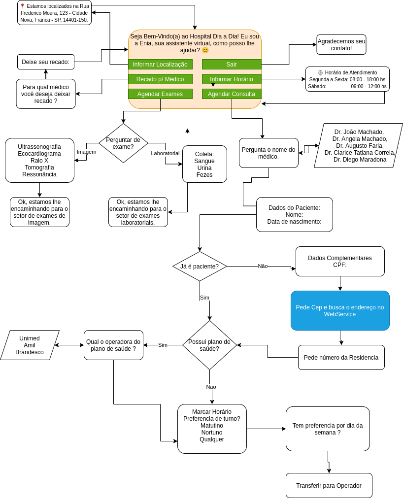

# Chatbot para Hospital Clinica.
Trabalho da Disciplina de Chatbots

**Autores: Charles Bambineti e Diego Leonardo Urban**

## Tecnologias utilizadas
Tentamos inicialmente usar o sistema Rasa,mas depois de muitas dificuldades migramos para o IBM Watson Assistan.
Utilizamos o webservice viacep.com.br para buscar um endereço pelo CEP informado pelo usuário, Uma Cloud Functions da IBM é chamada por um  WebHooks.
Para o sistema de métricas foi utilizado o Google Colab.

## O fucionamento
Foi criado um chatbot para atendimento em um hospital clinica, o usuário terá  as seguinte sopções iniciais:
- Agendar Consulta
- Agendar Exames
- Horário de Funcionamento
- Localização
- Recado para o Médico
- Atendente
- Sair

O agendamento de consulta é a funcão principal, inicialmente pede o nome do médico, nome do paciente e data de nascimento, pergunta se já é paciente, se não for paciente pedira CPF e CEP onde será buscado o endereço do WebService, sendo ou não paciente pergutara se tem plano de Saúde e qual o plano ou não, pede a preferência de periodo do dia e dia da semana, encerra mostrando os dados informados e mostrando mensagem que esta tranferindo para um atendente.
As funções Localização e  Horário de Funcionamento apenas mostram as informações e retornam ao inicio. 
A função Recado para o Médico pede nome do médico e o recado, retornando ao inicio.
Agendar Exames, pede se o exame é laboratorial ou de imagem, apresenta menssagem que esta encaminhando para setor responsável.
Atendente apena apresenta mensagem que esta sendo transferido para atendente.
Sair apenas se despede.

## Arquivos do projeto

- Arquivo JSON  (skill-AGENDAMENTO_CHATBOTSv5.json)
- Métricas no Google Colab: (https://colab.research.google.com/drive/19DrLrpCVZYGxdfnwgY_shpEC9BHjUmeC?usp=sharing)

## Fluxo de Diálogo

